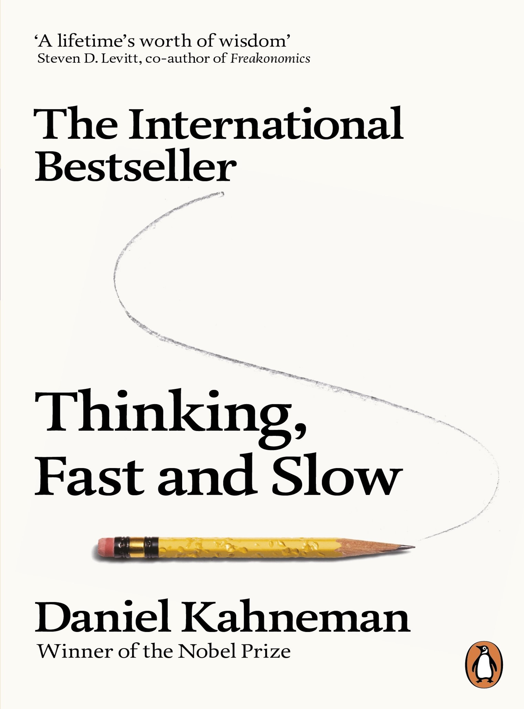
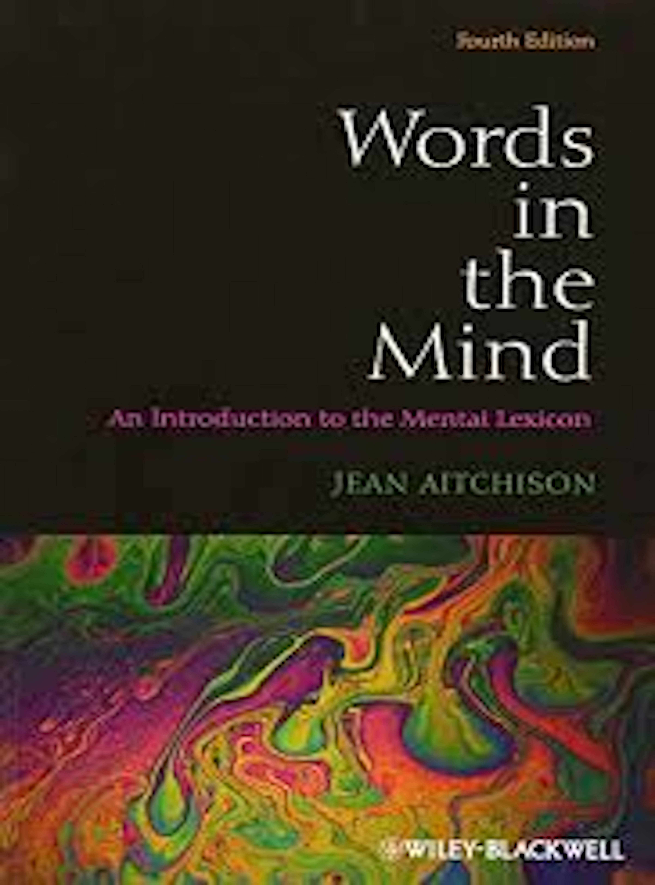
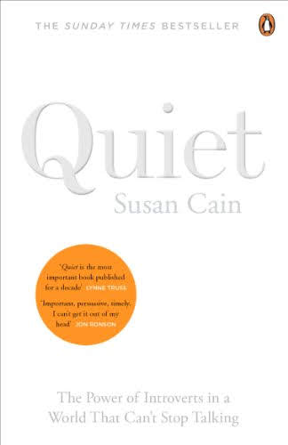

[< back](index.md)

# My virtual Bookshelf 

I've noticed that many people are curious about bookshelves. I'm no exception. The first thing I check out at a party is the host's bookshelf. So I'm not surprised that bookshelves have become a popular background for [YouTube videos](https://youtu.be/QmdXN2FR2eY). A bookshelf is a great opportunity to indirectly illustrate your personality and knowledge. As a student, I would have loved to take a look at the bookshelves of my favorite professors. If I had a bookshelf in my YouTube videos, I would select the following books to put them on display.

## Linguistic Theory

&nbsp;&nbsp;&nbsp;&nbsp;

&nbsp;&nbsp;&nbsp;&nbsp;&nbsp;&nbsp;&nbsp;&nbsp;

## Language and Mind

&nbsp;&nbsp;&nbsp;&nbsp;&nbsp;&nbsp;&nbsp;&nbsp;

&nbsp;&nbsp;&nbsp;&nbsp;&nbsp;&nbsp;&nbsp;&nbsp;&nbsp

## Science as an Adventure

&nbsp;&nbsp;&nbsp;&nbsp;&nbsp;&nbsp;&nbsp;&nbsp;

&nbsp;&nbsp;&nbsp;&nbsp;&nbsp;&nbsp;&nbsp;&nbsp;

## Communication

&nbsp;&nbsp;&nbsp;&nbsp;

&nbsp;&nbsp;&nbsp;&nbsp;&nbsp;&nbsp;&nbsp;&nbsp;

&nbsp;&nbsp;&nbsp;&nbsp;;&nbsp;&nbsp;&nbsp;

## Inspiring Biographies

&nbsp;&nbsp;&nbsp;&nbsp;&nbsp;&nbsp;&nbsp;&nbsp;

[< back to homepage](index.md)

