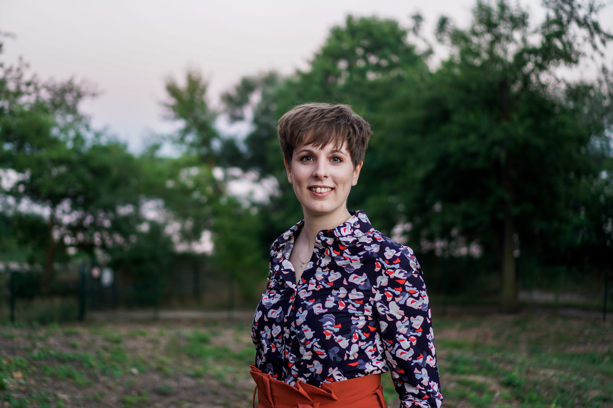

# Annika Tjuka, Linguist 

## News

+++ We submitted a Preprint for our article '[Linking Norms, Ratings, and Relations of Words and Concepts Across Multiple Language Varieties.](https://psyarxiv.com/tgw3z/)' to PsyArXiv. +++

+++ We released the first version of the Database of Cross-Linguistic Norms, Ratings, and Relations for Words and Concepts on [GitHub](https://github.com/concepticon/norare-data). +++

+++ Check out my virtual bookshelf [here](bookshelf.md). +++

## About me

I am a PhD Student at the International Max Planck Research School for the Science of Human History (IMPRS-SHH). The topic of my research is "Cross-Linguistic Strategies of Denotation: Advancing data and methods in lexical typology". 

I am interested in how different languages classify the objects around them. In my Master's thesis, I conducted the first systematic typological study on body part extensions in object and landscape terms. The cognitive foundation of expressions like 'foot of the mountain' or 'eye of the needle' were also of interest to me. 

My main goal is to accumulate the knowledge of various languages and bring it into the field of psycholinguistics. Thus, in my last project ([FAHMRRR](https://www.projekte.hu-berlin.de/en/fahmrrr/index.html?set_language=en)), I investigated the recall of focus alternatives in Vietnamese native speakers.

## Masters Thesis

**Body-part metaphors as a window to cognition: A cross-linguistic study of object and landscape terms**

Supervisors: Prof. Dr. Elisabeth Verhoeven and Dr. Kilu von Prince

Description: I conducted the first systematic typological study of body-part metaphors in object and landscape terms. The study consisted of 53 pictures illustrating object and landscape parts which were based on 93 body-part metaphors. The analysis showed that some metaphors are far more consistent across languages than others. For example, 'leg of the chair/table' is present throughout the whole language sample. 

DOI: [http://dx.doi.org/10.17613/j95n-c998](http://dx.doi.org/10.17613/j95n-c998) 

[BibTeX](/papers/tjuka2019_MA_thesis_bodypartmetaphors.bib)

[Video](https://youtu.be/7MWorOQrRnY)

[Elicitation material](https://doi.org/10.6084/m9.figshare.7613120.v1)

[Revised list of body-part metaphors](https://doi.org/10.6084/m9.figshare.7613189.v1)

## Bachelors Thesis

**Emotionalisation through texts**

Supervisors: Prof. Dr. Katharina Spalek and Prof. Dr. Manfred Krifka

Description: I collaborated with a software engineer to search my text corpora for emotional words. For this, we created a tool which utilized the Natural Language Processing Kit in Python, so that it could analyze the text corpora and compare them with a list of 3000 words. Afterwards, I analyzed the frequency and psycholinguistic measures of the matching words. The results of my study show that there are more emotional words in donation letters than in stock market letters.

## Curriculum Vitae

### Academic Education

2019 - Present | **PhD Student** at International Max Planck Research School for the Science of Human History (IMPRS-SHH) and Friedrich-Schiller-Universität Jena.
Supervisors: Dr. Johann-Mattis List and Prof. Dr. Volker Gast

2016 - 2019 | **Master of Arts in Linguistics** at
Humboldt-Universität zu Berlin

2012 - 2016 | **Bachelor of Arts in German Linguistics and Scandinavian Studies** at
Humboldt-Universität zu Berlin

### Work experience (in Academia)

2019 |  **Reseach Associate** in the [FAHMRRR](https://www.projekte.hu-berlin.de/en/fahmrrr/index.html?set_language=en) project, funded by the European Research Council (ERC): An investigation of how humans process meaning in utterances, concentrating on focus alternatives. In my project, I investigate the recall of focus alternatives among Vietnamese speakers.
Principal investigator: Prof. Dr. Katharina Spalek

2017 - 2019 |  **Student research assistant** in the [MelaTAMP](https://www.projekte.hu-berlin.de/en/melatamp/project%20description?set_language=en) project, funded by the German Research Foundation (DFG): A corpus- based research on TAM and polarity expressions in Oceanic languages of Melanesia.
Principal investigators: Dr. Kilu von Prince, Prof. Dr. Manfred Krifka

2016 - 2019 |  **Student research assistant** in the [FAHMRRR](https://www.projekte.hu-berlin.de/en/fahmrrr/index.html?set_language=en) project, funded by the European Research Council (ERC).
Principal investigator: Prof. Dr. Katharina Spalek

Support with neuroimaging data acquisition:
Spalek, K. and Oganian, Y. (2019). The neurocognitive signature of focus alternatives. _Brain and Language_ (194), 98-108.

2018 |  **Internship and student research assistant** in the group 'Modulation of Language Networks' at the Max Planck Institute for Human Cognitive and Brain Sciences.
Group head: Dr. Gesa Hartwigsen

Support with neuroimaging data acquisition: Kuhnke, P., Kiefer, M., and Hartwigsen, G. (2020). Task-dependent recruitment of modality-specific and multimodal regions during conceptual processing. _Cerebral Cortex_, 1-22.

[full CV](CV_tjuka.pdf)

### Administrative Service

2020 - Present |  PhD representative for the
DLCE department, Max Planck Institute for the Science of Human History

2017 - 2018 |  Women's representative for
Institute of Romance Studies, Humboldt-Universität zu Berlin

### Participation (Summer/Winter Schools, Workshops)

**2020**

 Workshop on Reproducible Research Data Management, Max Planck Institute for the Science of Human History, Jena, Germany.

**2019**

Summer Neurolinguistics School at the National Research University Higher School of Economics, Center for Language and Brain, Moscow, Russia.

## Preprints

Tjuka, Annika, Robert Forkel, and Johann-Mattis List (submitted). "Linking Norms, Ratings, and Relations of Words and Concepts Across Multiple Language Varieties." PsyArXiv. July 27. [https://psyarxiv.com/tgw3z/](https://psyarxiv.com/tgw3z/).

Tjuka, Annika (submitted). "Body part extensions with _mặt_ 'face' in Vietnamese."

Tjuka, Annika, Huong Thi Thu Nguyen, and Katharina Spalek (submitted). "Foxes, deer, or hedgehogs - The recall of focus alternatives in Vietnamese." Special Collection on Prosody and Speech Processing across Languages and Varieties in _Laboratory Phonology_.

## Publications

Tjuka, Annika, Lena Weißmann, and Kilu von Prince (2019). "[Tagging modality in Oceanic languages of Melanesia.](/papers/tjuka2019_tagging_modality_oceanic_LAW.pdf)" In _Proceedings of 13th Linguistic Annotation Workshop._ ACL Special Interest Group on Annotation.

Tjuka, Annika, Lena Weißmann, and Kilu von Prince (2019). "[Habitual aspect as a property of text spans.](/papers/tjuka2019_LTC_habitual_aspect.pdf)"  In Zygmunt Vetulani and Patrick Paroubek (eds.) _Human language technologies as a challenge for computer science and linguistics. Proceedings of 9th Language & Technology Conference._ Poznań: Wydawnictwo Nauka i Innowacje, 195-199.

## Databases

Annika Tjuka, Robert Forkel, & Johann-Mattis List (2020). concepticon/norare-data: Database of Cross-Linguistic Norms, Ratings, and Relations for Words and Concepts (Version v0.1) Available online at [http://doi.org/10.5281/zenodo.3957681](http://doi.org/10.5281/zenodo.3957681)

List, Johann Mattis & Rzymski, Christoph & Greenhill, Simon & Schweikhard, Nathanael & Pianykh, Kristina & Tjuka, Annika & Wu, Mei-Shin & Forkel, Robert (2020). Concepticon 2.4.0-rc.1. A Resource for the Linking of Concept Lists. Jena: Max Planck Institute for the Science of Human History. Available online at [https://concepticon.clld.org](https://concepticon.clld.org)

## Blog posts

Tjuka, Annika. "Adding concept lists to Concepticon: A guide for beginners," in Computer-Assisted Language Comparison in Practice, 29/01/2020, [https://calc.hypotheses.org/2225](https://calc.hypotheses.org/2225).

## Talks

**2020**

April. _[Similarity as the basis for meaning extensions.](/slides/tjuka2020_similarity_DLCEmeeting.pdf)_ Meeting of Department of Linguistic and Cultural Evolution, Max Planck Institute for the Science of Human History, Jena, DE.

**2019**

September. _[Revealing cognitive patterns: A cross-linguistic study of body-part metaphors.](/slides/tjuka2019_bodypart_metaphors_ALT.pdf)_ 13th International Conference of the Association for Linguistic Typology, Pavia, IT.

August. With Lena Weißmann and Kilu von Prince. _[Tagging modality in Oceanic languages of Melanesia.](/slides/tjuka2019_tagging_modality_LAW.pdf)_ The 13th Linguistic Annotation Workshop in conjunction with ACL, Florence, IT.

May. With Lena Weißmann and Kilu von Prince. _[Habitual aspect as a property of text spans.](/slides/tjuka2019_habitual_textspans_LTCworkshop.pdf)_ 9th Language & Technology Conference, Poznań, Poland.

May. (job talk) _Finding patterns - How to discover part-whole relations in cross-linguistic data._ Max Planck Institute for the Science of Human History, Jena, DE.

March. (job talk) _The cognitive foundation of body-part metaphors._ Max Planck Institute for Psycholinguistics, Nijmegen, NL.

**2018** 

November. _[The belly of the cabbage - Body-part metaphors as a window into the mind.](/slides/tjuka2018_bodypart_metaphors_synsemcolloquium.pdf)_ Colloquium Syntax and Semantic. Humboldt-Universität zu Berlin, DE.

October. _[Elicitation in linguistic fieldwork - or how to capture a speaker's view of the world.](/slides/tjuka2018_fieldwork_elicitation_studentconf.pdf)_ 3rd Conference for Student Research. Bochum, DE.

August. _[Can typological studies show us how the brain processes language?](/slides/tjuka2018_typological_studies_linguisticmeetup.pdf)_ 5th Linguistik Meet-up Berlin-Potsdam. Potsdam, DE.

July. (job talk) _Including linguistic variation to understand the processing of language._ Universität des Saarlandes. Saarbrücken, DE. 

May. _[Don't judge from the outside: A deeper look into the Vietnamese tense system.](/slides/tjuka2018_vietnamese_tenselessnes_StutSconf.pdf)_ 63rd  Student Conference Linguistics (StuTS). Kiel, DE.

April. _[Time and perspective in a supposedly tenseless language.](/slides/tjuka2018_vietnamese_tenslessnes_twistconf.pdf)_ 12th T.W.I.S.T. Student Conference for Linguistics, Leiden, NL.

## Posters

**2019**

August. _[A cross-linguistic study of body-part metaphors and their cognitive basis.](/posters/tjuka2019_bodypart_metaphors_SLE.pdf)_ 52nd Annual Meeting of the Societas Linguistica Europaea. Leipzig University, Germany.

July. _['The leg of the table' – Universal patterns of mapping body-part terms to object and landscape properties.](/posters/tjuka2019_bodypart_metaphors_conceptsofhumansandnature.pdf)_ Concepts of Humans and Nature between Specificity and Universality. Johannes Gutenberg-Universität, Mainz, Germany.

July. With  Huong Thi Thu Nguyen and Katharina Spalek. _[Shirts, scarves, or socks – Remembering focus alternatives in Vietnamese.](/posters/tjuka2019_vietnamese_focusalternatives_neurolinguisticsschool.pdf)_ Summer Neurolinguistics School 2019. National Research University Higher School of Economics, Center for Language and Brain, Moskow, Russia.

March. _[The heel of the bread and the tongue of the sea - Body-part metaphors in object and landscape terms.](/posters/tjuka2019_bodypart_metaphors_creativemetaphor.pdf)_ The Creative Power of Metaphor. Worcester College, Oxford, United Kingdom.

## Contact

<mail@annikatjuka.com>

[ResearchGate](https://www.researchgate.net/profile/Annika_Tjuka)

[Instagram](https://www.instagram.com/everyday_linguist/?hl=de)

