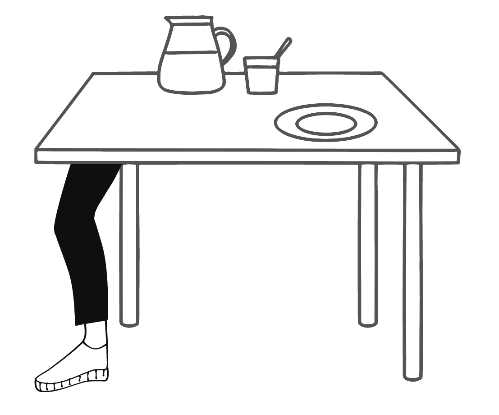
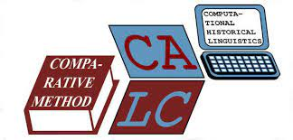
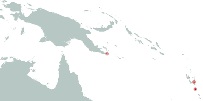

Life's motto: _Never not learning_    

# Annika Tjuka, Linguist   

## News

+++ I'm going to give a talk entitled "Meanings of body part terms: Cross-linguistic colexifications between body parts and objects" at [DUCOG](https://ducog.cecog.eu/) in May. +++

+++ Check out my new blog post on "[How to review concept lists in collaboration](https://calc.hypotheses.org/2680)" in Computer-Assisted Language Comparison in Practice. +++

+++ We submitted a Preprint for our article '[Linking Norms, Ratings, and Relations of Words and Concepts Across Multiple Language Varieties.](https://psyarxiv.com/tgw3z/)' to PsyArXiv. +++

+++ For some reading inspiration, take a look at my virtual bookshelf [here](bookshelf.md). +++    

## About me



I’m a linguist. My area of expertise is semantics, specifically semantic typology. I’m fascinated by the mental lexicon and the cognitive basis of semantic networks. My research is looking at language from a cross-linguistic perspective. So far, I conducted the first systematic study of body part terms for objects and landscape features in my Master's thesis. And I’m now a PhD at the MPI for the Science of Human History.

**Contact**

<mail@annikatjuka.com>

[ResearchGate](https://www.researchgate.net/profile/Annika_Tjuka)

[Twitter](https://twitter.com/AnnikaTjuka)    

## Curriculum Vitae

**Academic Education**

2019 - Present | **PhD Student** at International Max Planck Research School for the Science of Human History (IMPRS-SHH) and Friedrich-Schiller-Universität Jena.
Supervisors: Dr. Johann-Mattis List and Prof. Dr. Volker Gast

2016 - 2019 | **Master of Arts in Linguistics** at
Humboldt-Universität zu Berlin

2012 - 2016 | **Bachelor of Arts in German Linguistics and Scandinavian Studies** at
Humboldt-Universität zu Berlin

[show full CV](CV_tjuka.pdf)    

## Publications

**Journal Articles**
 
Tjuka, Annika, Huong Thi Thu Nguyen, and Katharina Spalek (2020). Foxes, deer, and hedgehogs: The recall of focus alternatives in Vietnamese. _Laboratory Phonology: Journal of the Association for Laboratory Phonology 11(1)._ 1–29. DOI: [10.5334/labphon.253](https://doi.org/10.5334/labphon.253) Note: We had to add a small [correction to our article](https://doi.org/10.5334/labphon.323). 

**Edited Volume Articles**

Tjuka, Annika (in review). "Body part extensions with _mặt_ 'face' in Vietnamese". In Kelsie Pattillo and Maɫgorzata Waśniewska (eds). Embodiment in Cross-Linguistic Studies: The 'Face'. Brill Studies in Language, Cognition and Culture. Brill. Preprint: [10.17613/23np-nt91](http://dx.doi.org/10.17613/23np-nt91)

**Preprints**

Tjuka, Annika (submitted). "The representation of foot/leg polysemy in the mind — Insights from Vietnamese body part extensions with _chân_." HCommons. DOI: [10.17613/21y2-yz64](http://dx.doi.org/10.17613/21y2-yz64)

Tjuka, Annika, Robert Forkel, and Johann-Mattis List (in review). "Linking Norms, Ratings, and Relations of Words and Concepts Across Multiple Language Varieties." PsyArXiv. July 27. [https://psyarxiv.com/tgw3z/](https://psyarxiv.com/tgw3z/)

**Proceedings**

Tjuka, Annika (2020). [General patterns and language variation: Word frequencies across English, German, and Chinese](https://www.aclweb.org/anthology/2020.cogalex-1.3). In M. Zock, E. Chersoni, A. Lenci, and E. Santus (Eds.), _Proceedings of the Workshop on the Cognitive Aspects of the Lexicon_ (pp. 23-32). Stroudsburg: Association for Computational Linguistics. Video available [here](https://youtu.be/AMqc9b4pY4g).

Tjuka, Annika, Lena Weißmann, and Kilu von Prince (2019). [Tagging modality in Oceanic languages of Melanesia](/papers/tjuka2019_tagging_modality_oceanic_LAW.pdf). In _Proceedings of 13th Linguistic Annotation Workshop._ ACL Special Interest Group on Annotation.

Tjuka, Annika, Lena Weißmann, and Kilu von Prince (2019). [Habitual aspect as a property of text spans](/papers/tjuka2019_LTC_habitual_aspect.pdf). In Z. Vetulani and P. Paroubek (Eds.), _Human language technologies as a challenge for computer science and linguistics. Proceedings of 9th Language & Technology Conference_ (pp. 195-199). Poznań: Wydawnictwo Nauka i Innowacje.

**Blog posts**

Tjuka, Annika. "How to review concept lists in collaboration (How to do X in linguistics 6)," in Computer-Assisted Language Comparison in Practice, 15/03/2021, [https://calc.hypotheses.org/2680](https://calc.hypotheses.org/2680).

Tjuka, Annika. "How to organize a virtual journal club (How to do X in linguistics 4)," in Computer-Assisted Language Comparison in Practice, 20/01/2021, [https://calc.hypotheses.org/2613](https://calc.hypotheses.org/2613).

Tjuka, Annika. "Possibilities of digital communication in linguistics (How to do X in linguistics 2)," in Computer-Assisted Language Comparison in Practice, 07/12/2020, [https://calc.hypotheses.org/2556](https://calc.hypotheses.org/2556).

Tjuka, Annika. "A list of 171 body part concepts," in Computer-Assisted Language Comparison in Practice, 28/09/2020, [https://calc.hypotheses.org/2512](https://calc.hypotheses.org/2512).

Tjuka, Annika. "Adding concept lists to Concepticon: A guide for beginners," in Computer-Assisted Language Comparison in Practice, 29/01/2020, [https://calc.hypotheses.org/2225](https://calc.hypotheses.org/2225).    

## Talks (most recent)

**2020**

December. _[General patterns and language variation: Word frequencies across English, German, and Chinese](/slides/tjuka2020_frequencies_CogALex.pdf)_. 6th Cognitive Aspects of the Lexicon Workshop ([CogALex](https://sites.google.com/view/cogalex-2020/home)) at COLING 2020, online. Video available [here](https://youtu.be/AMqc9b4pY4g).

October. _[The eye/ear of the needle – Cross-linguistic differences in body part extensions.](/slides/tjuka2020_body_object_colexifications_WoW.pdf)_ 1st Words in the World ([WoW](http://wordsintheworld.ca/wow-conference-2020/)) International Conference, online. Video available [here](https://youtu.be/ldQKwfyImYU).

September. _[Defining the obvious: How to measure similarity?](/slides/tjuka2020_similarity_STaPs.pdf)_ 16th Sprachwissenschaftliche Tagung für Promotionsstudierende, online.

April. _[Similarity as the basis for meaning extensions.](/slides/tjuka2020_similarity_DLCEmeeting.pdf)_ Meeting of the Department of Linguistic and Cultural Evolution, Max Planck Institute for the Science of Human History, online.    

## Projects

 

[Body-part metaphors as a window to cognition: A cross-linguistic study of object and landscape terms](ma-thesis.md)

 

[Computer-Assisted Language Comparison (CALC).](https://digling.org/calc/)

 

[Focus alternatives in the human mind: Retrieval, Representation and Recall (FAHMRRR)](https://www.projekte.hu-berlin.de/de/fahmrrr)

 

[MelaTAMP](https://www.projekte.hu-berlin.de/en/melatamp)    

## Databases

 

[Database of Cross-Linguistic Norms, Ratings, and Relations for Words and Concepts](https://digling.org/norare/)

 

[Concepticon. A Resource for the Linking of Concept Lists.](https://concepticon.clld.org/)    

## Teaching

upcoming (August) | Introduction to linguistics & cultural evolution, Lecture, MA/PhD,
Max Planck Institute for the Science of Human History, Summer School, online.

Summer Semester 2021 | _Words and their meanings across languages_, Seminar, BA, 
Friedrich Schiller University Jena, online. Syllabus available [here](https://www.notion.so/Syllabus-35ec90dab75f4770bc6ead65d9a871f2).

Winter Semester 2020/21 | _The mental lexicon from a cross-linguistic perspective_, Seminar, BA, 
Friedrich Schiller University Jena, online. Syllabus available [here](https://www.notion.so/Syllabus-812dc77904e849059d4639d484eecd88).    

## Outreach activities

**Tea with teachers**

2021 | Four Ways to PhD, Friedrich Schiller University, 
Department of English Studies, online.

**Long night of science**

2019 | Mitmachangebot: "Versuchen Sie auf gleiche Art und Weise wie die Krähen Neukaledoniens an Nahrung zu gelangen", 
Max Planck Institute for the Science of Human History, Jena.    

## Inspiration

**My virtual bookshelf**

[Click here](bookshelf.md)

**My favorite podcasts**

- [Lingthusiasm](https://lingthusiasm.com/)
- [Teaching in Higher Ed](https://teachinginhighered.com/)
- [History and Philosophy of the Language Sciences](https://hiphilangsci.net/category/podcast/)
- [In Our Time](https://www.bbc.co.uk/programmes/b006qykl)

